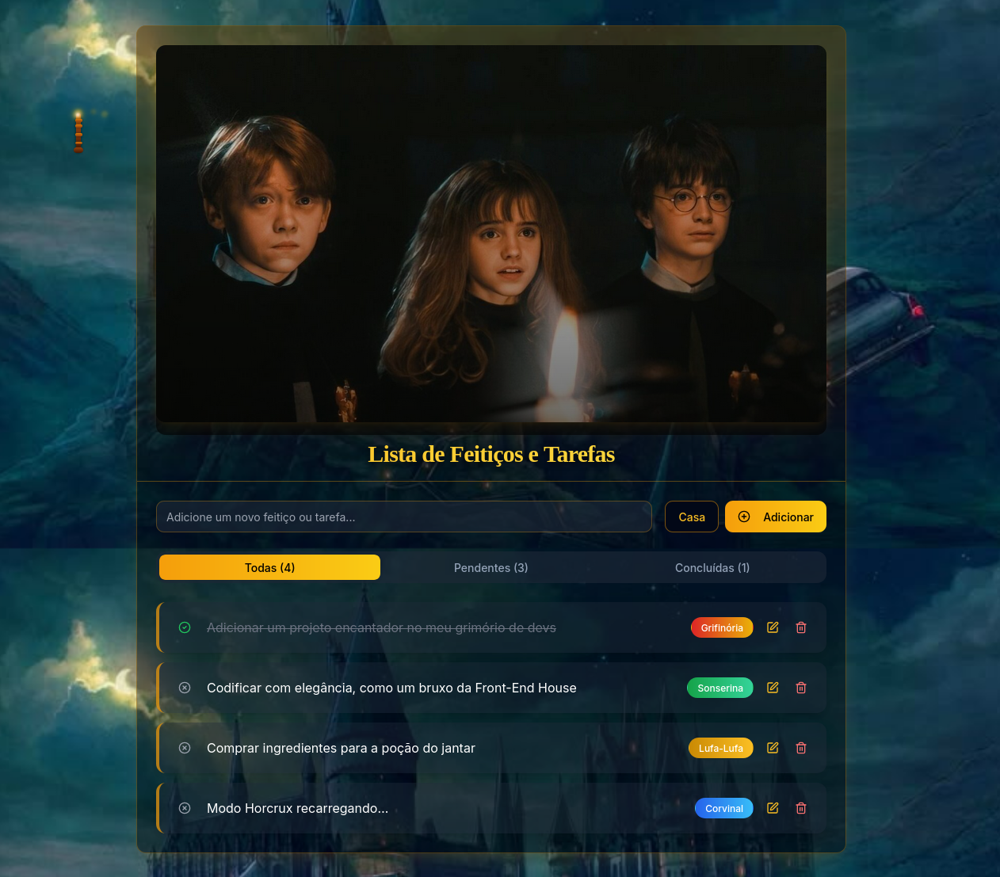

# 🪄 To-do List Mágica - Tema Harry Potter

Uma aplicação de lista de tarefas com **interface encantada**, inspirada no universo de Harry Potter. Ideal para organizar seu dia com um toque de magia! ✨🧙‍♀️

## 🔮 Demonstração



> Escolha sua casa de Hogwarts, adicione tarefas como “estudar feitiços” ou “limpar a sala com accio!” e marque quando concluir. Tudo com animações e sons mágicos!

---

## 🚀 Tecnologias Utilizadas

- [Next.js](https://nextjs.org/)
- [React 19](https://reactjs.org/)
- [TailwindCSS](https://tailwindcss.com/)
- [Radix UI](https://www.radix-ui.com/)
- [Framer Motion](https://www.framer.com/motion/) – animações suaves
- [react-hook-form](https://react-hook-form.com/) – formulários mágicos
- [zod](https://github.com/colinhacks/zod) – validações com feitiço
- [Lucide Icons](https://lucide.dev/) – ícones encantados


---


## 🎨 Inspiração Visual

- Fontes inspiradas em Hogwarts (como *Magic School One*)
- Ícones personalizados 
- Paletas de cor baseadas nas 4 casas:  
  - Grifinória 🦁  
  - Sonserina 🐍  
  - Corvinal 🦅  
  - Lufa-Lufa 🦡

---


---

## 🧙‍♀️ Exemplo de Tarefas

```json
[
  "Estudar feitiços de JavaScript",
  "Organizar o grimório (pastas do computador)",
  "Completar missão da Grifinória",
  "Beber poção calmante (café ou chá)",
  "Revisar encantamentos (componentes React)"
]
```


## 🧙‍♀️ Créditos

Desenvolvido com 🪄 por Mayara Rocha
Projeto criado para praticar Front-end com criatividade e magia ✨